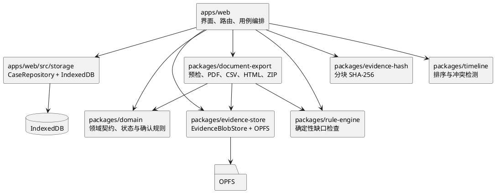
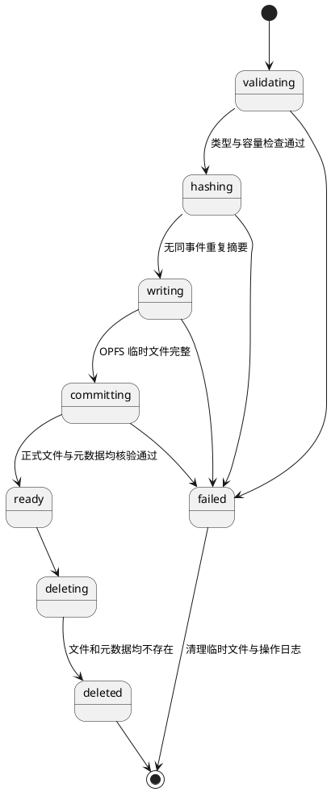

# 有据（YouJu）M2 无 AI 核心闭环设计规格

- 文档状态：已完成书面规格复核；M2 自动化验收完成，真实设备人工发布检查保留至 M4
- 里程碑：M2 No-AI Core
- 日期：2026-07-30
- 依据：有据 V0.1 已批准产品与技术设计规格、V0.1 Master Implementation Plan、M1 Foundation 基线
- 首发场景：`ecommerce_refund`

---

## 1. 问题、目标与范围

### 1.1 问题

M1 已建立领域契约、规则引擎、黄金案例、Web/API 外壳和质量门禁，但用户尚不能创建本地事件、导入材料、确认事实、整理时间线或导出材料包。M2 要在不依赖账号、服务端存储或 AI 的前提下，交付第一个可真实操作的本地闭环。

### 1.2 目标

M2 完成后，用户应能：

1. 在支持的浏览器中创建并自动保存网购退款纠纷事件；
2. 将受支持的原始材料导入设备本地存储并计算 SHA-256；
3. 手工分类材料、录入并确认事实；
4. 手工建立、排序并确认时间线；
5. 使用确定性规则识别必填事实和建议材料缺口；
6. 从已确认内容生成、编辑并确认事实陈述；
7. 通过导出前校验后生成 PDF、CSV、HTML 和包含原始材料的 ZIP；
8. 立即删除事件，并在核验结构化数据、原始材料和临时数据均消失后得到成功反馈。

### 1.3 非目标

M2 不包含：

- AI Provider、API Key、AI 分类、AI 提取或候选事实审核；
- 用户账号、云同步、服务端事件存储、数据库、队列或对象存储；
- 加密备份与恢复；
- 法律结论、赔偿计算、结果预测、自动投诉或第三方平台登录；
- 视频、音频、压缩包递归解析；
- 多人协作、多标签页自动合并；
- OPFS 不可用时的第二套文件 Blob 存储实现；
- 对用户上传 PDF 内容的解析、执行或重新排版。

### 1.4 设计原则

- **本地优先：** 结构化事件保存在 IndexedDB，原始文件保存在 OPFS，不上传业务服务端。
- **确认优先：** 草稿不能直接成为正式事实、正式时间线或正式陈述。
- **确定性优先：** 摘要、规则、排序、冲突、导出结构和删除核验均由确定性代码完成。
- **显式恢复：** IndexedDB 与 OPFS 之间没有共同事务，所有跨存储操作必须有操作日志和可恢复状态。
- **单一实现：** 对浏览器能力缺失进行明确降级，不以不完整的替代存储掩盖风险。
- **最小服务端：** M2 Web 不向 API 发送事件字段、材料、事实、时间线或导出内容；API 维持 M1 健康检查边界。

---

## 2. 已确认决策、假设与待定项

### 2.1 已确认决策

| 主题           | 决策                                                                                                       |
| -------------- | ---------------------------------------------------------------------------------------------------------- |
| OPFS 不可用    | 允许创建结构化事件并编辑手工事实、时间线；禁用文件导入和含附件的正式导出；不使用 IndexedDB Blob 或内存替代 |
| 本地静态加密   | M2 不增加应用层静态加密；依赖浏览器源隔离和设备安全，并向用户明确提示风险                                  |
| 文件上限       | 每事件最多 50 个文件、单文件最多 50 MiB、事件总文件最多 500 MiB；导入前检查浏览器剩余配额                  |
| 摘要与重复文件 | 提交前计算 SHA-256；同一事件内相同摘要不创建第二条材料记录；不同事件之间不共享文件                         |
| 删除           | 立即硬删除，无回收站；删除完成后核验 IndexedDB、OPFS 和临时数据；部分失败必须可重试                        |
| 导出           | M2 仅生成标准未加密提交包；加密备份与恢复作为后续独立设计                                                  |
| 首次体验       | 使用最小创建向导，进入事件工作台后可自由切换步骤；自动保存，不设置“保存”按钮                               |
| 并发           | 每个事件同一时间只允许一个写入标签页；其他标签页只读；不自动合并冲突                                       |
| 浏览器         | 自动化覆盖桌面 Chromium、移动 Chromium、移动 WebKit；内置浏览器仅能力检测，不承诺完整 PWA/OPFS             |
| 实施方式       | 按本地事件、证据、事实、导出、完整回归五个纵向切片推进，每个切片产生可验证行为                             |

### 2.2 设计假设

- 用户理解浏览器站点数据可能因清理浏览数据、设备故障或系统回收空间而丢失；产品必须在创建和导出位置明确提示。
- 浏览器允许在主线程外或分块执行高成本文件处理；具体 Worker 拆分由实施计划以性能测试决定，但不得改为一次性读取大文件。
- M1 黄金案例中的 JSON 文本材料继续用于契约回归；M2 为文件导入和导出增加完全虚构的二进制图片/PDF 样本。
- M2 正式陈述使用确定性模板生成，用户可以编辑后确认，但系统不自动生成法律性表述。

### 2.3 待定项

不存在会阻止编写 M2 实施计划的产品或架构待定项。PDF 中文字体嵌入、移动端分页和流式 ZIP 的具体依赖组合必须在对应任务的最小技术验证中通过后才能固定，不得以降低验收标准作为替代。

---

## 3. 推荐架构

### 3.1 模块关系



### 3.2 职责边界

#### `apps/web`

负责 Vue 页面、路由、表单、事件工作台、自动保存、浏览器能力检测和应用用例编排。页面不得直接操作 IndexedDB 或 OPFS；必须通过端口调用。

#### `apps/web/src/storage`

定义 `CaseRepository` 端口并提供 IndexedDB 实现。M2 将该适配器放在 Web 内部，不创建泛化的独立存储包。它负责结构化数据事务、数据库迁移、修订号检查和操作日志。

#### `packages/domain`

保存跨模块领域 Schema、类型、确认状态流转和正式输出过滤规则。它不依赖 Vue、IndexedDB、OPFS 或文档生成库。

M2 必须补足 `ConfirmedFact.fieldName`。M1 的 `ConfirmedFact` 只有 `factType`，无法在同一事实类型内可靠区分购买时间、订单号或平台名称，不能满足规则检查和确定性陈述生成。

#### `packages/evidence-store`

定义 `EvidenceBlobStore` 端口、OPFS 路径规范、临时文件写入、正式文件读取、删除和存在性核验。正式路径只使用事件 ID 和材料 ID，不使用原始文件名。

#### `packages/evidence-hash`

提供分块 SHA-256 接口和已知向量测试。输入为字节块或流，不读取领域对象，不负责持久化。

#### `packages/timeline`

提供时间线稳定排序、时间精度比较和冲突检测纯函数，不保存状态，不生成法律判断。

#### `packages/rule-engine`

继续使用 M1 版本化规则，输入只包含已确认事实字段和处于 `ready` 状态的材料分类。缺少必填事实产生阻断项，缺少建议材料产生警告项。

#### `packages/document-export`

负责导出快照、导出前校验、稳定命名、PDF/CSV/HTML 生成、附件摘要复核、ZIP 组装和临时文件清理。它只能接收正式数据视图，不得从草稿表直接读取内容。

### 3.3 服务端边界

`apps/api` 在 M2 继续只提供 M1 健康检查。Web 的事件操作、文件导入、摘要、规则、陈述和导出流程均不得调用 API。Service Worker 只能缓存应用壳和本地静态字体等产品资源，不得缓存事件响应、材料 Blob 或导出包。

---

## 4. 核心领域与持久化模型

### 4.1 IndexedDB 数据集

| 数据集                | 作用                                     | 正式输出可见性       |
| --------------------- | ---------------------------------------- | -------------------- |
| `cases`               | 事件基本信息、修订号、状态和能力提示确认 | 已确认字段可见       |
| `factDrafts`          | 手工录入的事实草稿                       | 不可见               |
| `confirmedFacts`      | 用户确认后的版本化正式事实               | 可见                 |
| `timelineEntries`     | 草稿与已确认时间线条目                   | 仅 `confirmed` 可见  |
| `statementDrafts`     | 模板生成或用户编辑的陈述草稿             | 不可见               |
| `confirmedStatements` | 用户确认后的版本化陈述                   | 最新且未过期版本可见 |
| `evidenceMetadata`    | 只保存完成提交的材料元数据               | `ready` 材料可见     |
| `operationJournal`    | 导入、删除、导出临时操作的恢复记录       | 不可见               |

### 4.2 代表性对象

以下结构表达必须保持的语义，最终 TypeBox Schema 由实施任务定义并测试：

```typescript
interface PersistedCaseEvent extends CaseEvent {
  revision: number
  lastWriterId: string
}

interface FactDraft {
  id: UuidV4
  caseId: UuidV4
  factType: FactType
  fieldName: FactFieldName
  value: string
  sourceRefs: SourceReference[]
  updatedAt: UtcTimestamp
  revision: number
}

interface VersionedConfirmedFact {
  id: UuidV4
  caseId: UuidV4
  factType: FactType
  fieldName: FactFieldName
  value: string
  sourceRefs: SourceReference[]
  confirmedAt: UtcTimestamp
  confirmationMethod: 'manual'
  replacesFactId: UuidV4 | null
  version: number
}

interface ConfirmedStatement {
  id: UuidV4
  caseId: UuidV4
  content: string
  confirmedAt: UtcTimestamp
  confirmedFactIds: UuidV4[]
  confirmedTimelineEntryIds: UuidV4[]
  ruleVersion: string
  version: number
}

type ImportOperationStage = 'validating' | 'hashing' | 'writing' | 'committing' | 'failed'
type DeleteOperationStage = 'deleting' | 'verifying' | 'failed'
type ExportOperationStage = 'preparing' | 'writing' | 'finalizing' | 'failed'

type OperationJournalEntry = EvidenceImportOperation | CaseDeleteOperation | PackageExportOperation

interface EvidenceImportOperation {
  operationId: UuidV4
  caseId: UuidV4
  evidenceId: UuidV4
  operationType: 'evidence_import'
  stage: ImportOperationStage
  temporaryStorageRef: string | null
  startedAt: UtcTimestamp
  errorCode: string | null
}

interface CaseDeleteOperation {
  operationId: UuidV4
  caseId: UuidV4
  operationType: 'case_delete'
  stage: DeleteOperationStage
  startedAt: UtcTimestamp
  errorCode: string | null
}

interface PackageExportOperation {
  operationId: UuidV4
  caseId: UuidV4
  operationType: 'package_export'
  stage: ExportOperationStage
  temporaryStorageRef: string
  startedAt: UtcTimestamp
  errorCode: string | null
}
```

### 4.3 草稿、确认与替换

- `FactDraft` 是用户手工录入对象，与 M1 的 `FactCandidate` 含义不同。M2 不通过构造虚假的 AI/规则候选来承载手工输入。
- 确认草稿时创建新的 `ConfirmedFact`，不把草稿对象就地改名。
- 修改已确认事实时创建替换版本，并通过 `replacesFactId` 建立关系；历史版本保留用于追踪，但只选择当前有效版本进入正式输出。
- `requestedResolution` 可以先存在事件表单草稿中；只有对应 `requested_resolution` 正式事实被确认后，才能进入陈述和导出。
- 上游正式事实被替换或材料引用发生变化时，相关时间线、规则结果和已确认陈述标记为过期，必须重新确认。
- 时间线草稿与确认条目使用显式状态；只有确认条目进入陈述和导出。
- 确认陈述每次生成新版本，不覆盖历史；引用的事实或时间线变化后，旧版本不得导出。

### 4.4 金额、ID 与时间

- 所有 ID 使用 UUID v4；测试使用固定、符合 UUID v4 格式的可读值。
- 持久化时间使用 ISO 8601 UTC 字符串。
- 人民币金额保存为整数分或十进制定点字符串，不使用二进制浮点数。
- Schema 版本为大于等于 1 的整数。

### 4.5 数据库版本与迁移

- IndexedDB 使用显式数据库版本和顺序迁移器。
- 单次结构化迁移在版本升级事务中完成；失败时保留旧数据并阻止写入。
- 不得以删除数据库重新开始作为迁移失败处理。
- 至少测试空库初始化、M1/早期 M2 结构升级、升级中断和未知较新版本只读阻断。

---

## 5. 状态机与一致性

### 5.1 材料导入状态



只有 `ready` 材料可以被事实、时间线、规则和导出引用。IndexedDB 与 OPFS 之间没有共同事务，因此 `operationJournal` 是恢复依据，而不是把两个写入视为原子操作。

### 5.2 事件工作状态

`CaseEvent.status` 继续使用 M1 契约：

- `draft`：创建完成但基础信息尚不完整；
- `in_progress`：已有正式事实或材料，仍存在必填缺口；
- `ready_to_export`：当前正式快照通过所有阻断校验；
- `exported`：至少完成一次与当前快照一致的成功导出。

任一被引用的正式事实、时间线或材料发生替换、删除或丢失时，状态必须从 `ready_to_export` 或 `exported` 回退到 `in_progress`。

### 5.3 单写入者并发

- 打开事件编辑页时获取事件级写锁；首个标签页为写入者，其他标签页只读。
- 支持 Web Locks 时使用浏览器锁协调；不支持时使用 IndexedDB 修订号进行乐观并发检查。
- 使用 `BroadcastChannel` 通知同源标签页锁状态和修订变化。
- 每次写入携带预期 `revision`；不一致时停止自动保存并显示 `concurrent_edit_conflict`。
- 冲突后要求用户重新加载最新内容，不自动合并、不静默覆盖。

---

## 6. 用户流程与交互

### 6.1 首次创建

首页进入最小创建向导，收集：

- 事件标题；
- 购买时间；
- 商家名称；
- 商品名称；
- 实付金额；
- 期望处理结果。

创建时先生成本地 UUID 事件，表单内容保存为草稿。创建成功后进入事件工作台，用户可自由切换“材料、事实、时间线、缺口、陈述、导出”六个区域。

### 6.2 自动保存

- 输入使用短防抖自动保存；导航、页面隐藏和关闭尝试时主动刷新待保存内容。
- 界面展示“正在保存”“已保存到此设备”“保存冲突”“存储失败”状态。
- 不提供会误导用户的独立“保存”按钮。
- 自动保存失败时保留当前表单输入，停止继续覆盖，并提供重试或重新加载路径。

### 6.3 工作台反馈

工作台持续显示：

- 已导入材料数量；
- 已确认事实数量；
- 已确认时间线数量；
- 阻断项和警告项数量；
- 当前本地保存状态；
- 是否获得写锁；
- 当前能否导出及具体阻断原因。

---

## 7. 文件导入与原始材料

### 7.1 能力检测

进入文件流程前检测：

- IndexedDB；
- OPFS；
- Web Crypto 基础能力；
- Web Locks；
- BroadcastChannel；
- `navigator.storage.estimate()` 配额信息。

IndexedDB 不可用时阻止创建事件。OPFS 不可用时保留结构化流程，但禁用文件导入和含附件的正式材料包导出，并明确说明浏览器能力限制。

### 7.2 导入校验顺序

1. 检查事件文件数量上限；
2. 检查单文件和事件累计大小；
3. 根据浏览器报告检查剩余配额；
4. 同时检查扩展名、声明 MIME 和文件签名；
5. 分块计算 SHA-256；
6. 检查同一事件内摘要重复；
7. 写入 OPFS 临时路径；
8. 核验写入大小和摘要；
9. 移动或提交到正式 UUID 路径；
10. 在 IndexedDB 创建 `ready` 材料元数据并清除操作日志。

支持的文件签名至少覆盖：

- JPEG；
- PNG；
- WebP 的 RIFF/WEBP 组合；
- PDF 文件头。

扩展名、MIME 和签名不一致时拒绝导入。原始文件名只用于安全转义后的界面展示和导出显示，不参与 OPFS 路径。

### 7.3 限额与配额

- 每事件最多 50 个文件；
- 单文件最多 50 MiB；
- 每事件原始材料总量最多 500 MiB；
- 所有大文件读取、摘要和写入使用分块或流式处理；
- 超限或配额不足只拒绝本次新增文件，不破坏已保存材料。

### 7.4 重复与派生文件

- 同一事件内发现相同 SHA-256 时，不创建第二个 `EvidenceFile`，并定位现有材料。
- 不同事件即使摘要相同，也分别保存和管理，不建立跨事件共享或引用计数。
- 裁剪、标注或脱敏产生新文件、新摘要和新的材料记录；若后续版本实现该能力，必须记录其来源关系，不能覆盖原件。

### 7.5 引用保护

被正式事实、已确认时间线或当前正式陈述引用的材料不能直接删除。界面列出引用位置，用户先移除或替换引用，再执行删除。发现 OPFS 文件丢失或摘要改变时，相关正式输出立即失效并阻止导出。

---

## 8. 事实、时间线、规则与陈述

### 8.1 手工事实

- 表单输入首先写入 `FactDraft`。
- 用户确认后创建 `ConfirmedFact`；事实必须保留 `factType`、`fieldName`、值和来源引用。
- `purchase_time`、`merchant_name`、`product_name`、`paid_amount`、`order_number`、`platform_name`、`received_time` 和 `merchant_response` 进入正式输出时至少关联一份 `ready` 材料。
- `problem_description` 和 `requested_resolution` 可以作为用户亲自确认的陈述不关联材料；界面仍应允许用户主动添加来源。
- 金额输入规范化为整数分或定点字符串，界面本地化显示不改变持久值。

### 8.2 时间线

- 时间精度只允许 `minute`、`date`、`approximate`、`unknown`。
- 稳定排序先按可比较时间，再按时间精度和用户顺序；未知时间保留用户顺序并置于已知时间之后。
- 同一事实出现不一致日期、同一支付事实出现不一致金额或事件顺序明显矛盾时产生冲突提示。
- 未解决冲突阻止正式导出；时间线条目必须逐项确认。

### 8.3 规则检查

规则引擎只接收当前有效的 `ConfirmedFact.fieldName` 和 `ready` 材料分类。结果分为：

- `blocking / missing_fact`：阻止导出；
- `warning / missing_evidence`：允许继续，但导出页必须明确提示。

M2 不新增法律规则或频繁变化的政策结论。

### 8.4 事实陈述

陈述草稿只由以下内容确定性生成：

- 当前有效的已确认事实；
- 已确认时间线；
- 已确认的期望处理结果；
- 确定性规则结果。

用户可以编辑草稿，然后显式确认形成 `ConfirmedStatement`。陈述记录所引用的事实版本和时间线条目；任一引用变更后陈述标记过期，重新确认前不得导出。

模板不得生成“商家违法”、赔偿金额、胜诉率、投诉成功率或其他法律结论。

---

## 9. 导出设计

### 9.1 导出前校验

以下情况阻止正式导出：

- 缺少必填正式事实；
- 缺少必须来源的事实来源；
- 存在未解决的时间或金额冲突；
- 没有当前有效的已确认陈述；
- 陈述引用的事实或时间线版本已过期；
- 引用材料不是 `ready`、文件不存在或摘要复核失败；
- OPFS 不可用而导出包含附件；
- PDF、CSV、HTML 或 ZIP 生成失败。

缺少建议材料只产生警告，不自动阻止导出。用户必须在导出页看到风险提示和缺失清单。

### 9.2 固定目录结构

```text
有据_事件材料包_YYYYMMDD_HHmm/
├── 01_事件说明.pdf
├── 02_事件时间线.pdf
├── 03_证据材料清单.pdf
├── 04_材料摘要校验表.csv
├── 05_附件索引.html
└── 06_原始材料/
```

导出过程先生成不可变快照，再生成文本文件，最后重新读取并核验每个附件摘要，流式写入 OPFS 临时 ZIP。浏览器下载成功发起后清理临时数据。取消或失败不得保留半成品正式包。

### 9.3 文档内容

- 事件说明 PDF：封面、使用边界、基本信息、事实陈述、缺失材料提醒、生成时间和应用版本。
- 时间线 PDF：已确认时间线、时间精度和来源编号。
- 证据清单 PDF：材料编号、分类、原始名称、大小、导入时间和 SHA-256。
- 摘要 CSV：附件相对路径、大小、媒体类型和 SHA-256。
- 附件索引 HTML：可离线打开的静态索引，不加载脚本或远程资源。
- 原始材料目录：保存原始字节，不修改用户文件内容。

### 9.4 输出安全

- HTML 与 PDF 对用户文本进行转义，不生成脚本、事件属性或远程请求。
- CSV 对以 `=`、`+`、`-`、`@` 开头的单元格进行公式注入防护。
- ZIP 路径拒绝绝对路径、`..`、控制字符和路径分隔符穿越。
- 文件名经过稳定清理；附件编号与清单编号一致。
- 用户上传 PDF 仅作为原始附件复制，不解析其中对象，不把其页面合并进生成 PDF。
- M2 导出包不加密；导出前提示材料可能包含敏感信息并建议妥善保存。

---

## 10. 删除与删除核验

### 10.1 用户确认

删除事件是不可撤销操作。确认页显示材料、事实、时间线和导出临时数据数量，建议用户先导出备份，但不强制。用户必须输入事件标题或明确的确认短语后才能开始。

### 10.2 删除顺序

1. 创建 `case_delete` 操作日志并将事件置为删除中；
2. 删除 OPFS 正式材料和该事件临时文件；
3. 删除所有结构化子记录；
4. 删除事件主记录；
5. 查询 IndexedDB 确认事件及子记录均不存在；
6. 枚举 OPFS 确认事件目录和临时路径均不存在；
7. 清除操作日志并显示成功。

只有全部核验通过才能显示“已删除”。部分失败时显示低敏错误类别、仍待清理的类别和重试操作，不伪造成功状态，不建立云端或隐藏备份。

### 10.3 启动恢复

应用启动时扫描未完成操作：

- `validating`、`hashing`：移除操作记录；
- `writing`：删除临时文件并移除操作记录；
- `committing`：核验正式文件与元数据，完成提交或回滚；
- `deleting`：继续删除并重新核验；
- 导出临时状态：删除不完整 ZIP 和临时文档。

恢复过程必须幂等，多次执行结果一致。

---

## 11. 错误模型与用户恢复

### 11.1 稳定错误码

M2 至少定义并测试：

- `storage_not_supported`；
- `storage_quota_exceeded`；
- `file_type_mismatch`；
- `file_too_large`；
- `duplicate_evidence`；
- `hash_mismatch`；
- `concurrent_edit_conflict`；
- `export_validation_failed`；
- `delete_verification_failed`。

错误对象只包含低敏错误码、阶段、事件 ID、操作 ID 和可安全展示的上下文，不包含文件内容、完整原始路径或用户输入正文。

### 11.2 关键降级

| 条件             | 行为                                                 |
| ---------------- | ---------------------------------------------------- |
| IndexedDB 不可用 | 阻止创建事件，说明当前浏览器无法可靠保存             |
| OPFS 不可用      | 保留结构化流程；禁用文件导入和含附件正式导出         |
| 配额不足         | 拒绝本次文件导入，保留已有数据                       |
| 数据库迁移失败   | 保留旧数据、阻止写入、提供重新加载和导出诊断信息路径 |
| 并发修订冲突     | 停止自动保存，要求重新加载，不覆盖远端标签页版本     |
| 摘要复核失败     | 标记材料不可用于正式输出并阻止导出                   |
| 删除核验失败     | 保持删除中状态，列出失败类别并允许重试               |

---

## 12. 安全与隐私

### 12.1 本地数据保护

- M2 不实现应用层静态加密，界面必须明确说明站点数据依赖设备锁、操作系统账户和浏览器源隔离。
- 事件结构化内容不得写入 `localStorage`、Cookie、日志、统计事件或 Service Worker 缓存。
- 文件 Object URL 使用后立即撤销。
- 不引入分析 SDK、会话回放、远程字体或不必要的第三方脚本。
- 原始材料和导出包不进入 API 请求、错误上报或后台任务。

### 12.2 不可信输入

- 文件扩展名、MIME、签名和大小均不可单独信任。
- 所有用户文本在 HTML/PDF/CSV 上下文中分别编码。
- 文件名不得成为存储路径，ZIP 内相对路径必须经过规范化和白名单构造。
- 依赖生成器不获得网络访问或服务端权限；所有生成在浏览器本地完成。

### 12.3 内容边界

产品继续明确声明：

- 有据不提供法律意见；
- 文件摘要不等于司法鉴定或公证；
- 材料整理结果不保证退款、投诉或协商结果；
- 用户应保存原始设备和原始文件。

---

## 13. 依赖策略

M2 允许在对应任务证明必要性后引入以下最小依赖：

| 能力         | 首选                            | 采用理由                                                           | 替代方案及拒绝理由                                   |
| ------------ | ------------------------------- | ------------------------------------------------------------------ | ---------------------------------------------------- |
| IndexedDB    | `idb`                           | 对原生 IndexedDB 提供轻量 Promise 与类型封装，不改变浏览器数据模型 | 原生回调 API 可行但事务错误处理和升级代码更易出错    |
| 增量 SHA-256 | `@noble/hashes`                 | 支持增量更新，避免一次性读取大文件                                 | Web Crypto `digest()` 不能直接表达增量哈希           |
| ZIP          | `fflate`                        | 浏览器可用、体积较小并支持流式压缩接口                             | 手写 ZIP 风险高；一次性内存组包不符合移动端限制      |
| PDF          | `pdf-lib` 与 `@pdf-lib/fontkit` | 浏览器生成、嵌入本地字体并可进行确定性布局                         | 浏览器打印结果不稳定；手写 PDF 成本和风险高          |
| 中文字体     | Noto Sans CJK SC 本地资产       | 覆盖简体中文，许可证允许随应用分发                                 | 远程字体违反离线与隐私边界；系统字体无法可靠嵌入 PDF |

依赖采用规则：

- 只在首次使用该能力的任务中添加并由 `pnpm-lock.yaml` 固定实际版本；
- 提交说明版本、许可证、维护状态、替代方案和必要性；
- 字体作为本地静态资产按需加载，并按实际字符子集嵌入生成 PDF；
- 流式 ZIP 写入 OPFS 临时文件，不在内存中构造完整 500 MiB 包；
- PDF 库只生成产品文本文件，不解析或修改用户上传 PDF；
- 首个 PDF 任务必须验证中文、长文本、分页和移动设备内存；验证失败时停止采用该组合并回到设计复核；
- Vue Composition API 足以管理 M2 状态时不引入 Pinia。

参考：[`idb`](https://github.com/jakearchibald/idb)、[`@noble/hashes`](https://github.com/paulmillr/noble-hashes)、[`fflate`](https://github.com/101arrowz/fflate)、[`pdf-lib`](https://github.com/Hopding/pdf-lib)、[Noto CJK](https://github.com/notofonts/noto-cjk)。实际采用前以对应官方仓库和发布包元数据复核版本与许可证。

---

## 14. 测试策略

### 14.1 纯函数与契约测试

覆盖：

- 文件扩展名、MIME、签名和限额组合；
- SHA-256 已知向量及不同分块大小结果一致；
- 金额与 UTC 时间规范化；
- 正式事实创建、替换和当前版本选择；
- 时间线稳定排序、时间精度和冲突检测；
- 仅正式数据进入输出；
- 规则精确结果；
- 导出前阻断原因；
- HTML 转义、CSV 公式注入和 ZIP 路径安全；
- 导出文件稳定命名和摘要表。

### 14.2 Repository 契约测试

每个 `CaseRepository` 实现运行同一套契约测试，覆盖：

- 创建、读取、更新和修订号；
- 自动保存和事务失败；
- 数据库迁移；
- 单写入者冲突；
- 事件级联删除和删除核验。

IndexedDB、OPFS、Web Locks 等浏览器能力必须在真实浏览器引擎中测试，不用自制 DOM 或内存数据库替身掩盖差异。

### 14.3 浏览器集成测试

覆盖：

- IndexedDB 写入后刷新恢复；
- OPFS 分块写入和读取；
- 大文件分块摘要；
- 同事件重复材料；
- 导入过程中断和启动恢复；
- 配额不足；
- OPFS 不可用降级；
- 被引用材料删除阻断；
- 多标签页单写入者；
- 删除后 IndexedDB 与 OPFS 均无残留。

### 14.4 导出结构测试

自动解析生成包并验证：

- 固定目录和文件名；
- 三份 PDF 可被独立读取且包含规定章节；
- CSV 表头、转义和摘要与原始附件一致；
- HTML 不含脚本、事件属性或远程资源；
- ZIP 无绝对路径和目录穿越；
- 原始附件字节和 SHA-256 与导入时一致；
- 失败或取消后无临时导出残留。

### 14.5 黄金案例无 AI E2E

使用完全虚构的四份二进制材料执行：

1. 创建事件；
2. 导入四份材料；
3. 刷新并恢复；
4. 手工分类；
5. 确认六项事实；
6. 确认四项时间线；
7. 运行规则检查；
8. 生成、编辑并确认事实陈述；
9. 通过导出前校验并下载材料包；
10. 解析并核验材料包；
11. 删除事件；
12. 核验 IndexedDB、OPFS 和临时数据无事件残留。

自动化项目覆盖桌面 Chromium、移动 Chromium 和移动 WebKit。人工发布检查覆盖 Windows Chrome/Edge、Android Chrome 和 iOS Safari；国内 Chromium 浏览器在所需 API 可用时按完整流程检查，微信等内置浏览器只验证能力提示和安全降级。

---

## 15. 实施切片

详细实施计划应按以下纵向切片拆分为小任务，并在每个行为变更中执行 TDD：

### 切片 A：本地事件生命周期

事件创建、IndexedDB Repository、自动保存、刷新恢复、单写入者和结构化删除核验。

### 切片 B：证据生命周期

浏览器能力检测、文件检查、OPFS、分块 SHA-256、同事件去重、手工分类、引用保护和恢复。

### 切片 C：正式事实链

手工事实草稿与确认、事实版本、时间线排序与冲突、规则缺口、陈述生成与确认。

### 切片 D：正式输出

不可变导出快照、预检、PDF、CSV、HTML、流式 ZIP、附件摘要复核和失败清理。

### 切片 E：完整回归

二进制黄金材料、刷新恢复、移动端、无 AI 完整 E2E、删除核验和 M2 威胁复查。

每个切片先交付可观察的端到端行为，再扩展同一能力的异常路径；不得先创建一批没有消费者的空包或占位接口。

---

## 16. 验收标准

M2 只有在以下条件全部满足后完成：

- 无需账号、API 或 AI 即可完成创建至导出；
- 原始材料只保存在设备本地，刷新后可恢复且摘要可核验；
- 文件类型、数量、大小、总量和配额限制生效；
- 未确认事实、未确认时间线、过期陈述、冲突和丢失来源不会进入正式输出；
- 规则结果完全确定且只表达事实或材料缺口；
- 导出 ZIP 符合固定目录，附件、索引和摘要一致；
- HTML、CSV、ZIP 路径和用户文本通过对应安全测试；
- 删除只有在 IndexedDB、OPFS 和临时数据核验为空后才报告成功；
- 不支持所需浏览器能力时给出诚实、可操作的降级反馈；
- 桌面 Chromium、移动 Chromium、移动 WebKit 的规定自动化测试通过；
- 根级 `pnpm verify`、禁止内容检查和 M2 威胁模型复查通过；
- API 仍无用户业务数据持久化，仓库中没有账号、AI 或法律判断功能扩张。

---

## 17. 风险与控制

| 风险                         | 控制                                                                |
| ---------------------------- | ------------------------------------------------------------------- |
| 移动浏览器回收站点数据       | 明确本地存储风险、鼓励及时导出、刷新恢复测试；M2 不虚假承诺永久保存 |
| IndexedDB 与 OPFS 部分提交   | 操作日志、临时路径、`ready` 门槛、启动幂等恢复                      |
| 500 MiB 文件集合导致内存峰值 | 文件处理和 ZIP 均分块/流式；首个依赖任务做移动端内存验证            |
| PDF 中文字体体积和分页不稳定 | 本地字体、字符子集、长文本和分页技术验证门槛                        |
| 多标签页静默覆盖             | 事件级单写入者、修订号、冲突停止自动保存                            |
| 恶意文件名或文本污染导出     | 上下文编码、稳定命名、CSV/ZIP 安全测试                              |
| 用户误解未加密本地或导出数据 | 创建与导出位置明确说明设备安全和敏感信息风险                        |
| 删除只清元数据未清原件       | 分阶段删除、OPFS 枚举、结构化查询和成功前核验                       |

---

## 18. 与 V0.1 规格的追踪

| V0.1 要求        | M2 设计落实                                                |
| ---------------- | ---------------------------------------------------------- |
| 无 AI 完整可用   | 手工事实、时间线、规则、模板陈述和导出完整闭环             |
| 本地优先         | IndexedDB + OPFS，API 不接收业务数据                       |
| 原始材料保护     | 原始字节保存、SHA-256、派生副本不覆盖原件                  |
| 正式内容必须确认 | 草稿、正式事实、正式时间线、正式陈述分离并版本化           |
| 缺失材料检查     | 复用版本化确定性规则引擎                                   |
| PDF/ZIP          | 固定三份 PDF、CSV、HTML、原始附件目录和摘要复核            |
| 删除全部本地数据 | 删除操作日志、跨存储删除和结果核验                         |
| 移动端可完成     | 移动 Chromium/WebKit 自动化和真实设备人工检查              |
| 安全默认值       | 文件多重检查、资源上限、输出编码、无远程脚本与日志敏感内容 |

V0.1 规格允许本地备份采用加密或未加密方案。M2 选择标准未加密提交包以完成可提交材料闭环；加密备份与恢复仍属于 V0.1 后续可设计能力，不与 M2 的提交包混为一体。

---

## 19. 当前状态与后续

本规格已完成书面复核，M2 已按实施计划完成并通过本地自动化验收。M2 当前没有已知的核心闭环功能阻塞。

仍保留以下发布前验证项：

- 真实手机上的大图导入性能；
- 国产浏览器兼容性；
- 低存储空间和设备清理数据后的用户风险验证。

上述事项属于 M4 发布前人工检查，不改变 M2 的本地优先、无 AI 和未加密导出边界。完成真实设备与存储边界验证后，再决定是否进入 M3 BYOK AI 设计；在此之前不新增 AI、云同步或加密备份实现。
