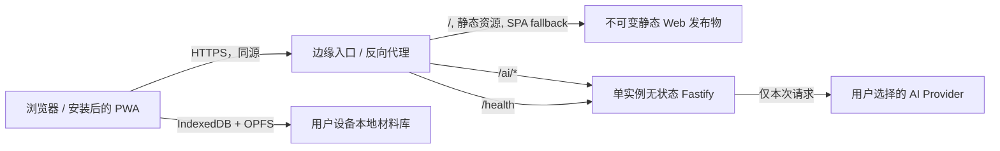
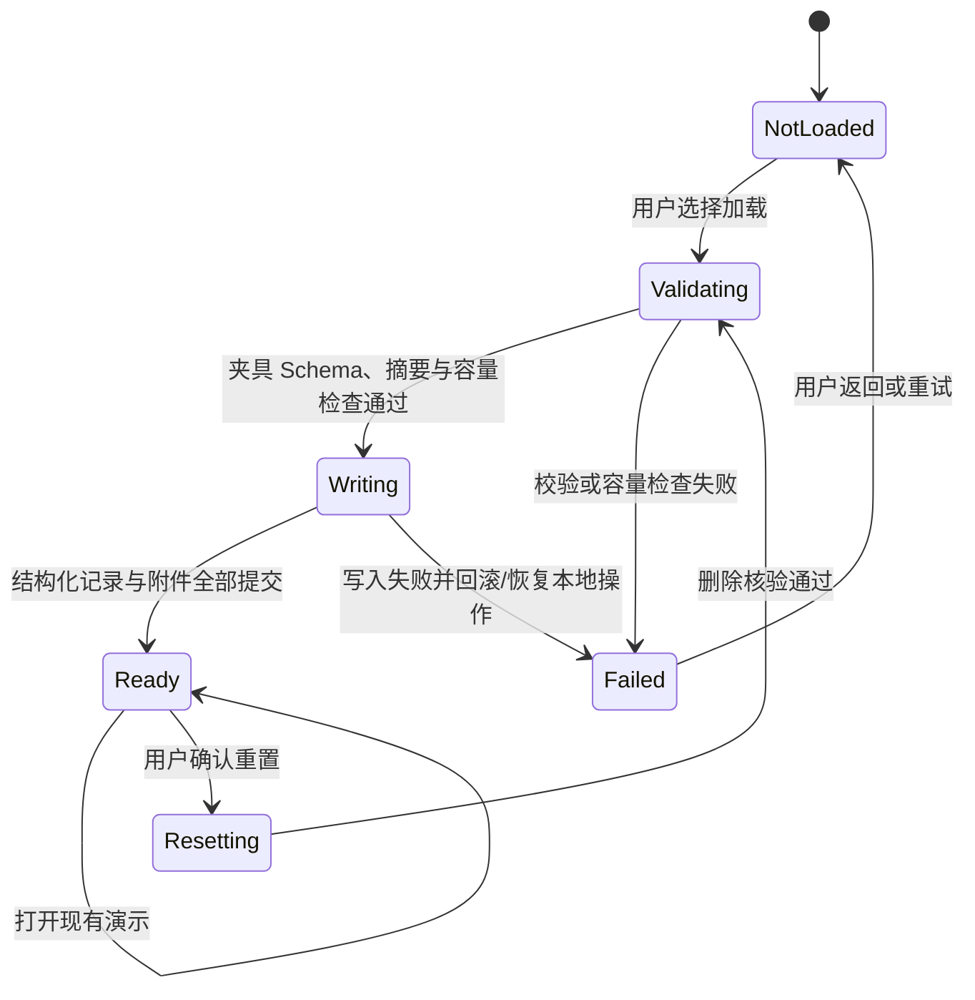

# 有据 V0.1 M4「公开演示与部署」设计规格

> 状态：设计方向已确认
>
> 日期：2026-08-13
>
> 适用范围：M4「公开演示与部署」
>
> 前置基线：M1 基础工程、M2 无 AI 核心、M3 BYOK AI
>
> 确认记录：2026-08-13，用户批准 D-01 至 D-06 的推荐方向
>
> 本文层级：已批准方向设计，不是详细实施计划、部署操作手册或机器可验证接口契约

## 1. 问题、目标与边界

### 1.1 问题

M1 至 M3 已形成可在本地开发环境运行的 Web/PWA、浏览器本地材料库、确定性导出流程，以及可选的 BYOK AI 临时转发能力。M4 需要把这些能力变成普通用户可以直接访问、理解和安全试用的公开演示版本。

公开部署不能改变有据的本地优先边界：用户材料仍以浏览器 IndexedDB 与 OPFS 为唯一默认业务存储，服务端不得因此获得用户业务数据的长期副本。部署还必须同时处理 PWA 更新、本地数据可恢复性、反向代理信任、静态资源缓存、安全响应头、真实设备兼容性和运维回滚等问题。

### 1.2 目标

M4 完成后，公开演示应满足：

1. 中国大陆常用网络环境下可以直接打开 HTTPS 页面，不要求注册或登录。
2. 用户不配置 AI，也能加载完全虚构的演示案例并走通整理、确认、导出和删除主流程。
3. PWA 应用壳可离线打开；已有本地事件在浏览器能力允许时可离线继续编辑。
4. 浏览器不会缓存、同步或后台上传原始材料、API Key、AI 请求或 AI 响应。
5. PWA 更新不会在用户无感知时强制刷新并丢失页面会话状态。
6. BYOK AI 继续使用同源、无状态 Fastify 临时转发，不引入服务端业务数据库、对象存储、队列或共享平台密钥。
7. 公开页面清楚解释本地存储、浏览器清理风险、AI 发送范围、第三方 Provider 边界、导出敏感性和非法律服务边界。
8. 发布前有可重复的生产构建、安全头、离线更新、真实设备、部署回滚和故障处理门禁。

### 1.3 非目标

M4 不包括：

- 用户账号、登录、跨设备同步或云端备份；
- 服务端保存事件、材料、事实、时间线、导出包或 AI 结果；
- 内置共享 AI Key、代付模型费用或自动选择 Provider；
- 自动投诉、第三方发送、法律建议、责任判断或结果预测；
- 埋点、会话回放、广告、用户画像或远程错误追踪；
- 加密备份包、超大材料包、后台同步、推送通知或离线 AI；
- 自动部署流水线、生产域名选择、备案或其他合规结论；
- M5 的匿名完成率、真实用户研究和效果评估。

## 2. 设计证据

### 2.1 已确认事实（Confirmed Facts）

| 编号 | 事实                                                                                                                 | 依据                                |
| ---- | -------------------------------------------------------------------------------------------------------------------- | ----------------------------------- |
| F-01 | V0.1 只支持网购商品质量、破损或描述不符且商家未妥善处理的场景。                                                      | 根 `AGENTS.md`、V0.1 设计           |
| F-02 | 无 AI 时必须可完成创建、导入、事实确认、时间线、缺失提醒、陈述和导出。                                               | 根 `AGENTS.md`                      |
| F-03 | 原始材料默认保存在 IndexedDB/OPFS 所代表的浏览器本地存储中，不默认上传。                                             | 根 `AGENTS.md`、M2 设计             |
| F-04 | API Key 仅存在于当前页面会话内存，不得写入任何持久化、日志、缓存或导出。                                             | 根 `AGENTS.md`、M3 设计与实现       |
| F-05 | 当前 API 仅有 `/health`、`/ai/connection-test` 和 `/ai/tasks/:taskType`，AI 路由为无状态临时转发。                   | `apps/api/src` 当前实现             |
| F-06 | 当前 API 对动态响应统一设置 `Cache-Control: no-store`，并对敏感请求字段执行日志脱敏。                                | `apps/api/src/app.ts` 当前实现      |
| F-07 | 当前 Fastify 未配置 `trustProxy`，直接使用 `request.ip` 做进程内限流。                                               | `apps/api/src/app.ts`、请求保护实现 |
| F-08 | 当前 PWA 使用 `autoUpdate`，预缓存 JS、CSS、HTML、图片和清单，未配置运行时缓存。                                     | `apps/web/vite.config.ts`           |
| F-09 | 当前没有首次使用引导、隐私说明页、演示案例来源标识、全局离线状态或更新提示。                                         | 当前路由与页面实现                  |
| F-10 | 当前生产 Web 构建包含较大的主 JS、PDF worker 和本地字体资源，公开网络加载需要专项预算与按需加载。                    | 当前构建产物与构建日志              |
| F-11 | 现有 Playwright 覆盖桌面 Chromium、移动 Chromium 与移动 WebKit，但使用开发服务器，尚未形成生产 Service Worker 验证。 | `playwright.config.ts`、现有 E2E    |
| F-12 | M3 未完成项明确包括真实 Provider、真实移动设备、部署后 HTTPS `/ai`、代理/TLS/超时/断连和 Provider 条款检查。         | M3 设计与威胁检查表                 |

### 2.2 设计假设（Design Assumptions）

| 编号 | 假设                                                                               | 可逆性与验证方式                                           |
| ---- | ---------------------------------------------------------------------------------- | ---------------------------------------------------------- |
| A-01 | 首版公开演示采用一个公开站点域名，静态 Web 与 Fastify `/ai` 同源。                 | 可通过反向代理配置替换，不进入业务数据模型；部署冒烟验证。 |
| A-02 | 首版只运行一个 Fastify 实例，保留现有进程内并发和速率保护。                        | 后续扩容前需补边缘限流或重新评审共享协调方案。             |
| A-03 | 首次引导和更新提示偏好属于低敏本地设置，保存在 IndexedDB 的独立偏好存储中。        | 可迁移；删除本地数据时统一删除。                           |
| A-04 | 用户完成首次真实事件创建或材料导入后，应用主动请求持久化存储权限，并如实展示结果。 | 浏览器不支持或拒绝时降级为风险提示。                       |
| A-05 | 公开演示不采集产品使用指标；自愿反馈跳转到外部渠道或复制反馈模板。                 | M5 如需匿名指标，另做隐私和数据最小化评审。                |
| A-06 | 首次公开版本保留最近一个可回滚发布产物，并让 Web 与 API 按同一发布编号成对回滚。   | 运维策略可调整，不影响用户本地数据。                       |

### 2.3 已确认决策（Confirmed Decisions）

以下决策已于 2026-08-13 获用户确认，详细实施计划不得自行改变：

| 编号                   | 推荐选择                                                                                                                    | 影响                                                                             |
| ---------------------- | --------------------------------------------------------------------------------------------------------------------------- | -------------------------------------------------------------------------------- |
| D-01 部署目标          | 先批准“同源静态站点 + 单实例 Fastify”的可移植部署契约，再单独选择供应商、区域、域名和证书方案。                             | 供应商与区域会影响大陆可达性、成本、备案及运维责任；本文不作法律结论。           |
| D-02 公开 AI 状态      | 页面展示 BYOK AI，但默认关闭、无共享 Key；无 AI 演示为发布阻断门禁，真实 Provider 结果按“已验证/未验证”公开记录。           | 不让某个付费 Provider 的可用性阻断核心演示，也不对未验证 Provider 作可用性承诺。 |
| D-03 演示身份          | 在 `CaseEvent` 增加明确的 `dataOrigin` 与 `demoFixtureId`，演示导出始终带“完全虚构演示数据”标记。                           | 这是核心数据模型与所有导出格式的兼容变更，需要迁移与回归。                       |
| D-04 日志保留          | 仅保留已脱敏的低敏运行日志，最长 7 天；支持运维平台时优先更短。                                                             | 影响故障定位、隐私暴露面与平台成本；禁止记录 IP 原文、请求体、Key 和模型内容。   |
| D-05 反馈渠道          | 首版以本地复制反馈模板为必选基础能力；配置公开仓库后可增加 GitHub/Gitee Issue，跳转前提示将离开有据，绝不自动附带事件内容。 | 不新增反馈 API；未确定仓库地址时不显示失效外链。                                 |
| D-06 Provider 发布门禁 | 真实 Key 测试不进入 CI；每个能获得测试 Key 的预设 Provider 用完全虚构的最小样本人工验证，无法验证的预设明确标记。           | 需要用户在相应 Task 中临时提供测试 Key，并确认 Provider 条款。                   |

## 3. 推荐架构

### 3.1 生产拓扑



核心约束：

- 浏览器只使用相对路径访问 `/ai/*`，不内置跨域 API 地址，不开放通用 CORS。
- 反向代理终止 TLS，静态资源与 API 使用同一可见源，避免跨源凭据和预检复杂度。
- SPA fallback 只适用于页面路由；`/ai/*`、`/health` 和不存在的带扩展名静态资源不得回退到 `index.html`。
- 边缘入口删除客户端伪造的转发头，再写入受信的 `Forwarded` 或 `X-Forwarded-*`。
- Fastify `trustProxy` 只能配置为实际代理的固定 IP/CIDR，禁止直接设为 `true`。Fastify 官方说明默认不信任代理，并警告在未验证代理时转发头可被伪造。[Fastify `trustProxy`](https://fastify.dev/docs/latest/Reference/Server/#trustproxy)
- 首版单实例与现有进程内速率/并发限制一致。多实例扩容会使每实例限制失去全局语义，必须先增加边缘层限制或重新评审，不能静默扩容。
- API 不挂载持久卷，不保存用户材料，不提供管理后台，不执行异步业务任务。

### 3.2 路由与缓存策略

| 路径/资源                             | 处理方     | 缓存策略                              | 说明                                     |
| ------------------------------------- | ---------- | ------------------------------------- | ---------------------------------------- |
| `/`, 页面路由, `index.html`           | 静态 Web   | `no-cache` 或短缓存并重新验证         | 确保新发布可以被发现。                   |
| 带内容哈希的 JS/CSS/图片              | 静态 Web   | `public, max-age=31536000, immutable` | 文件名变化即新版本。                     |
| `sw.js`, Web Manifest, `release.json` | 静态 Web   | `no-cache`                            | 避免 Service Worker 和版本描述长期陈旧。 |
| `/ai/connection-test`                 | Fastify    | `no-store`                            | API Key 和连接结果不得缓存。             |
| `/ai/tasks/:taskType`                 | Fastify    | `no-store`                            | AI 请求与响应不得缓存。                  |
| `/health`                             | Fastify    | `no-store`                            | 只返回非敏感健康状态和可选发布编号。     |
| 导出下载与页面 `blob:` URL            | 浏览器内存 | 不进入 Service Worker Cache           | 使用后及时撤销 URL。                     |

### 3.3 PWA 缓存边界

Service Worker 只能预缓存构成应用壳的版本化静态资源。Service Worker 需要安全上下文，且其安装/激活生命周期天然支持后台下载新版本并等待激活。[MDN Service Worker API](https://developer.mozilla.org/en-US/docs/Web/API/Service_Worker_API)

允许预缓存：

- `index.html` 的离线回退所需壳；
- 路由、基础样式、图标和 Web Manifest；
- 经体积预算批准的完全虚构演示清单；
- 进入离线主流程必须的确定性代码。

禁止预缓存或运行时缓存：

- `/ai/*` 与 `/health`；
- IndexedDB、OPFS 中的任何用户业务数据；
- 用户导入文件、导出包和动态 `blob:` URL；
- API Key、AI 发送预览、AI 请求、AI 响应和候选内容；
- 第三方 Provider、反馈渠道或其他外部源；
- 后台同步队列、推送订阅和定时上传任务。

M4 应把当前 `autoUpdate` 改为显式更新提示。Web 端通过 `onNeedRefresh` 和 `onOfflineReady` 展示状态，只有用户确认后才激活新版本；这是 `vite-plugin-pwa` 官方提供的提示式更新模式。[Prompt for update](https://vite-pwa-org.netlify.app/guide/prompt-for-update.html)

### 3.4 生产构建预算

公开网络场景应把首屏与离线壳作为明确门禁：

- 首屏 HTML、CSS 和关键 JS 的压缩传输总量目标不超过 500 KiB；
- Service Worker 应用壳预缓存目标不超过 2 MiB，不包含按需 PDF worker、本地大字体和演示附件；
- PDF 解析、文档导出、AI 页面和大字体按路由或动作懒加载；
- 不引入远程字体、第三方脚本、CDN 运行时依赖或统计 SDK；
- 构建应输出包体分析记录，超过预算必须解释并经评审，不以关闭警告作为处理方式。

这些是首版可调整的工程预算，不是产品数据格式约束。

## 4. 核心模型与所有权

### 4.1 演示案例身份

为避免虚构演示材料被误认为真实事件，推荐扩展领域模型：

```json
{
  "id": "9f7eb4d0-6b20-4cc5-94e1-123456789abc",
  "scenarioType": "ecommerce_refund_dispute",
  "title": "完全虚构演示：耳机到货破损退款争议",
  "dataOrigin": "fictional_demo",
  "demoFixtureId": "m4-ecommerce-refund-demo-v1",
  "storageMode": "local",
  "schemaVersion": 2
}
```

字段语义：

- `dataOrigin`：必填判别字段，只允许 `user_created` 或 `fictional_demo`；旧数据迁移为 `user_created`。
- `demoFixtureId`：仅 `fictional_demo` 必填，用于识别演示版本和幂等重载；真实事件不得携带。
- 演示身份由 `CaseEvent` 拥有，导出服务、页面横幅和删除服务只能读取，不得自行推断标题或 ID。

不变量：

1. 演示案例的每个对象与文件都使用新生成的 UUID v4，本地引用必须完整重写，不能复用固定运行时 ID。
2. 演示数据必须由现有公开服务和仓储写入，不能直接绕过校验写数据库。
3. 演示案例所有页面持续展示“完全虚构演示数据”。
4. 演示案例生成的 PDF、CSV、HTML、ZIP 和事实陈述必须携带不可遗漏的演示标记，文件名使用明确的 `DEMO` 前缀。
5. 加载、重置或删除演示案例不得修改任何 `user_created` 事件。

### 4.2 演示夹具

演示夹具以现有完全虚构的黄金案例为来源，发布时生成经过校验的只读应用资产。夹具拥有：

- 事件和期望处理结果；
- 虚构材料元数据与可公开分发的最小附件；
- 已确认事实、时间线、缺失材料结果和陈述；
- 夹具版本与完整性摘要。

夹具不包含：

- API Key 或 Provider 设置；
- 预先确认的 AI 候选；
- 真实姓名、手机号、地址、订单号、商家、聊天内容或设备信息；
- 指向外部资源的 URL。

“一键加载”不得触发网络上传、AI 调用或反馈请求。若同版本演示已存在，界面只提供“打开现有演示”与“重置演示”两种明确操作，不静默创建重复副本。

### 4.3 本地应用偏好

`LocalAppPreferences` 由 `apps/web` 拥有，不进入 `packages/domain`：

```json
{
  "schemaVersion": 1,
  "onboardingVersionSeen": 1,
  "lastAcknowledgedReleaseId": "2026.08.0",
  "storagePersistence": "granted"
}
```

- `storagePersistence` 只记录最后一次 `unknown | granted | denied | unsupported` 结果，不代替实时能力检查。
- 偏好中不得出现事件标识、API Key、Provider 请求或用户行为计数。
- “删除全部本地数据”必须删除该偏好存储；清除后再次展示首次引导。

### 4.4 发布描述

构建时生成只读 `release.json`，建议包含：

```json
{
  "schemaVersion": 1,
  "releaseId": "2026.08.0",
  "gitCommit": "<full-commit-sha>",
  "builtAt": "2026-08-13T08:00:00.000Z",
  "databaseVersion": 4,
  "caseSchemaVersion": 2,
  "demoFixtureId": "m4-ecommerce-refund-demo-v1"
}
```

该文件不得包含环境变量、内部主机名、Provider Key 或部署凭据。页面“关于”区域与 `/health` 可以显示同一 `releaseId`，用于确认静态站点与 API 是否成对发布。

## 5. 核心流程、状态与不变量

### 5.1 首次访问

1. HTTPS 页面加载应用壳，执行浏览器能力检测。
2. 首次引导用三屏以内说明：本地保存、无 AI 可用、AI 需自带 Key 且发送前预览、浏览器清理可能删除数据、产品不提供法律结论。
3. 引导可跳过，不把“同意条款”作为使用手工核心流程的前置条件。
4. 首页提供“加载虚构演示”和“创建我的事件”两个主入口。
5. 不请求通知、定位、摄像头、麦克风或后台同步权限。

### 5.2 请求持久化存储

浏览器存储默认通常是 best-effort，在存储压力下可能被清理；`navigator.storage.persist()` 可请求持久化存储，但浏览器可以批准或拒绝。[MDN 存储配额与逐出](https://developer.mozilla.org/en-US/docs/Web/API/Storage_API/Storage_quotas_and_eviction_criteria) [MDN `StorageManager.persist()`](https://developer.mozilla.org/en-US/docs/Web/API/StorageManager/persist)

推荐流程：

1. 不在空白首页首屏自动请求权限。
2. 用户创建真实事件或首次导入材料后，在用户动作上下文中请求持久化。
3. 批准后显示“浏览器已允许持久保存”，但仍提醒浏览器设置中的主动清除会删除数据。
4. 拒绝或不支持时显示非阻断风险提示，并建议及时导出材料包。
5. 私密浏览模式中明确提示会话结束后数据可能消失，不承诺可靠识别所有浏览器私密模式。

### 5.3 加载演示案例



加载必须复用 M2 的容量预检、OPFS 能力降级、本地操作恢复和删除核验。禁止显示虚假成功；附件不支持时应明确说明降级范围。

### 5.4 离线与恢复在线

- `navigator.onLine` 只作为界面提示，不作为事实来源；实际请求失败仍按网络错误处理。
- 离线时允许打开已缓存应用壳、浏览已有本地事件、编辑并导出本地数据。
- 离线时 AI 入口显示不可用原因，不删除会话内 Key，也不自动排队重试。
- 恢复在线后不自动发送任何材料或 AI 请求，用户必须重新点击并再次完成发送确认。
- `/health` 失败不能阻断无 AI 本地核心流程。

### 5.5 PWA 更新

1. 新 Service Worker 下载完成后进入 `update_available`，页面显示非阻断更新提示。
2. 用户有未完成导入、导出、AI 请求或草稿写入时，刷新按钮暂缓并解释原因。
3. 用户确认更新前先完成可等待的本地写入；无法安全完成时不刷新。
4. 激活新版本并刷新会自然清空页面内存中的 API Key；更新提示需提前说明这一点。
5. 数据库迁移失败时停止进入工作区，展示只读恢复与导出指引，不循环刷新或清库。

### 5.6 发布与回滚

1. 生成同一 `releaseId` 的 Web 与 API 发布物。
2. 完成自动质量门禁、生产 PWA E2E、安全头检查和人工设备矩阵。
3. 先部署 API，健康检查通过后再切换静态 Web；兼容性要求 API 至少兼容当前和前一个 Web 发布。
4. 冒烟验证无 AI 演示、导出、删除和更新流程。
5. 失败时把 Web 与 API 回滚到已验证的同一发布编号。
6. 回滚不得删除或迁移用户浏览器数据；破坏性本地 Schema 迁移必须另做设计评审。

## 6. 公开演示体验与说明内容

### 6.1 首页与首次引导

首页必须直接回答：

- 有据能做什么：保存材料、整理事实、建立时间线、发现缺口、导出材料包；
- 不能做什么：不给法律意见、不预测结果、不代发投诉；
- 数据在哪里：默认只在当前浏览器；
- AI 是否必须：不是，默认关闭；
- 现在如何试用：加载完全虚构演示或创建真实事件。

首页不得继续显示与当前里程碑不符的“后续里程碑再实现”占位文案。

### 6.2 隐私与 AI 数据说明

公开说明至少覆盖：

1. IndexedDB、OPFS 和页面会话内存分别保存什么；
2. 浏览器清理、卸载、私密浏览、存储压力和更换设备的影响；
3. 有据服务端不为用户保存业务数据副本，也无法替用户恢复；
4. 导出包可能包含敏感信息，用户应自行保管和核对；
5. AI 默认关闭，发送前逐项预览，Key 只在当前页面内存；
6. AI 内容会经过有据 Fastify 临时转发到用户选择的 Provider；
7. Provider 自身的保留、训练、跨境和条款由 Provider 决定，用户应在启用前核对；
8. AI 只生成候选，未经用户确认不得进入正式输出；
9. 删除本地数据的范围，以及外部 Provider 已收到数据不受本地删除控制；
10. 当前发布编号、开源仓库、反馈入口和已验证浏览器/Provider 矩阵。

### 6.3 自愿反馈

首版不建设反馈后端。推荐提供：

- 可复制的纯文本模板，只包含发布编号、浏览器类别和用户主动填写的问题；
- GitHub/Gitee Issue 链接，或经确认的公开邮箱；
- 跳转前提醒用户不要粘贴订单、聊天、地址、手机号、API Key 或材料文件。

应用不得自动附带 URL 查询、事件 ID、标题、文件名、页面截图、AI 输入输出或设备指纹。

## 7. 安全设计

### 7.1 安全响应头

内容安全策略应以 HTTP 响应头部署到所有页面响应。MDN 指出 CSP 可以限制资源来源并降低 XSS、点击劫持和混合内容风险，响应头比仅使用页面 `<meta>` 能覆盖更多指令。[MDN CSP 指南](https://developer.mozilla.org/en-US/docs/Web/HTTP/Guides/CSP)

首版建议基线：

```text
Content-Security-Policy:
  default-src 'self';
  script-src 'self';
  style-src 'self';
  img-src 'self' data: blob:;
  font-src 'self';
  connect-src 'self';
  worker-src 'self' blob:;
  manifest-src 'self';
  object-src 'none';
  base-uri 'none';
  frame-ancestors 'none';
  form-action 'self';
  media-src 'none';
  upgrade-insecure-requests
```

同时设置：

- `Strict-Transport-Security`：HTTPS 与子域策略确认稳定后启用，是否包含子域和 preload 单独决策；
- `X-Content-Type-Options: nosniff`；
- `Referrer-Policy: no-referrer`；
- 严格 `Permissions-Policy`，关闭摄像头、麦克风、定位、支付、USB 等未使用能力；
- `Cross-Origin-Opener-Policy: same-origin`；
- 页面和静态资源适用的 `Cross-Origin-Resource-Policy: same-origin`；
- API、健康检查和动态错误响应保持 `Cache-Control: no-store`。

不为首版启用强制 COEP，因为当前产品不依赖跨源隔离，且它可能扩大第三方兼容性风险。CSP 先在生产候选环境执行 Report-Only 人工检查，再切换强制模式；未获批准不得增加远程 CSP 上报端点。

### 7.2 同源 API 防护

- 反向代理只允许已定义的 `/ai/connection-test` 和 `/ai/tasks/:taskType` 方法与路径。
- API 校验 `Origin` 与 Fetch Metadata：浏览器跨站请求拒绝；缺少这些头的非浏览器客户端仍需通过现有 Schema、体积、目标地址和速率限制。
- 边缘与 Fastify 的请求体上限保持一致，边缘值不得大于应用允许值。
- 连接超时、首字节超时、总时长、客户端断连和 Provider 断连沿用 M3 的确定性终止语义。
- 自定义 Base URL 继续执行 HTTPS、端口、DNS、私网地址、重定向、证书和实际连接地址校验。
- 日志只允许请求 ID、路由类别、状态码、耗时、Provider 枚举、错误类别和粗粒度 IP 分类；禁止原始 IP 与完整 User-Agent。

### 7.3 密钥与秘密配置

- 公开仓库、静态构建、Source Map、`release.json`、容器镜像和日志中不得包含任何 Provider Key。
- 生产秘密仅限部署基础设施本身需要的凭据；Fastify 不配置共享 Provider Key。
- Source Map 若公开必须确认不包含构建环境路径或秘密；默认不对公网发布调试 Source Map。
- 真实 Provider 冒烟使用专用、低额度、可撤销测试 Key，测试后立即撤销或轮换，不写入脚本和截图。

## 8. 运维、保留与故障边界

### 8.1 备份和恢复

- 用户业务数据没有服务端备份；用户主动导出是唯一可移交备份。
- 运维只备份源代码引用、锁文件、构建产物摘要、部署配置模板和运行手册。
- 至少保留当前与前一个已验证发布物，确保无需重新构建即可回滚。
- 部署平台的卷、数据库、对象存储和队列保持未配置状态，避免形成事实上的业务数据持久化。

### 8.2 日志与访问

- 推荐最长保留 7 天，平台允许时使用更短周期；到期自动删除。
- 只有发布和故障处理责任人可访问，禁止公开日志面板。
- 不启用请求/响应 body 捕获、全量访问 IP、会话录制或第三方错误追踪。
- 故障记录引用请求 ID、发布编号和错误类别，不复制用户输入。

### 8.3 健康检查与告警

- `/health` 只验证进程存活、基本配置可解析和发布编号，不调用付费 Provider。
- 告警只基于可用性、5xx 比例、延迟、进程资源和证书到期，不基于用户内容。
- Provider 故障不能把无 AI 核心流程标记为整个站点不可用。
- 证书、DNS、静态入口、API 入口和磁盘/内存分别有故障排查步骤。

### 8.4 故障分级

| 级别     | 示例                                   | 用户行为                           |
| -------- | -------------------------------------- | ---------------------------------- |
| 核心阻断 | 页面无法打开、本地库迁移失败、导出损坏 | 停止发布或立即回滚。               |
| 局部阻断 | `/ai` 不可用、单个 Provider 故障       | 保持本地核心流程，显示明确降级。   |
| 兼容降级 | OPFS、持久化存储或安装不支持           | 展示能力说明，允许结构化流程继续。 |
| 体验问题 | 更新提示、布局或反馈链接异常           | 评估影响，不能掩盖数据风险。       |

## 9. 兼容性与发布门禁

### 9.1 自动门禁

除现有根级 `pnpm verify` 外，M4 需要增加生产候选验证：

- 用生产构建启动 HTTPS 或等价安全上下文；
- 验证首次安装、离线壳、更新提示与缓存边界；
- 断言 Cache Storage 中不存在 `/ai`、用户材料或导出内容；
- 验证 history fallback 不吞掉 API/静态 404；
- 验证安全响应头与 CSP 无违规；
- 验证演示夹具校验、幂等加载、重置、导出标记和删除隔离；
- 验证旧本地数据迁移为 `user_created`；
- 验证断网后本地编辑以及恢复网络后不自动发送；
- 验证 Web 与 API `releaseId` 一致。

### 9.2 人工设备矩阵

最低矩阵：

| 平台           | 浏览器                 | 必测重点                                      |
| -------------- | ---------------------- | --------------------------------------------- |
| Windows        | 最新稳定 Chrome、Edge  | 首屏、导入、导出、更新、安全头、下载。        |
| Android        | 最新稳定 Chrome        | 安装、OPFS、离线恢复、系统返回、文件选择。    |
| Android        | 一个实际常用国产浏览器 | 直接访问、核心流程、能力降级与下载。          |
| iOS            | 最新稳定 Safari        | 添加到主屏幕、存储、后台恢复、文件导入导出。  |
| 微信内置浏览器 | 当前版本               | 只验证可访问与降级提示，不承诺完整 PWA 安装。 |

每个平台至少走通：加载演示、打开附件、确认事实、导出、刷新重开、删除；支持 PWA 的平台再验证安装、离线壳和版本更新。

### 9.3 真实 Provider 人工检查

- 不进入 CI，不将 Key 存入 `.env`、脚本、快照或终端历史记录。
- 每次只使用完全虚构的最小文本或图片，先核对发送预览再调用。
- 记录 Provider、模型、协议、日期、网络环境、结果、错误映射和条款核对状态，不记录 Key 与内容正文。
- 连接测试、取消、超时、错误响应、候选 Schema 校验和页面刷新清 Key 均需检查。
- 未获得 Key 或未完成条款核对的 Provider 标记为“本版本未做真实验证”，不能写“已支持并可用”。

## 10. 重要备选方案与取舍

### 10.1 静态站点与 API 分域

不推荐首版采用。分域会引入 CORS、预检、额外 CSP `connect-src`、两个证书/域名和更复杂的错误排查。只有静态托管平台无法安全反代 Fastify，且独立 API 域名的大陆可达性已验证时才适用。

### 10.2 Serverless 函数替代常驻 Fastify

本轮不选。M3 的 DNS 固定、实际连接地址校验、超时和断连行为依赖可控网络客户端；不同函数平台的出站网络、请求时长和连接语义差异较大。若未来选择 Serverless，必须先证明不削弱 M3 SSRF 和资源保护契约。

### 10.3 Service Worker 自动更新

不推荐当前 `autoUpdate` 继续用于公开版。它实现简单，但页面刷新时会清除会话内 API Key，也可能打断草稿、导入或导出。显式提示多一个界面状态，却更符合本地优先产品对用户控制和可恢复性的要求。

### 10.4 在应用内收集匿名反馈

M4 不选。即使不含姓名，页面路径、设备信息、事件统计和错误上下文组合后仍可能扩大数据面。首版外部自愿反馈足以验证公开演示；匿名指标留给 M5 独立评审。

### 10.5 通过标题识别演示案例

不推荐。标题可编辑且无法为导出、删除和迁移提供稳定不变量。显式判别字段增加一次兼容迁移，但能防止演示材料被误提交，也能确保删除不影响真实事件。

## 11. 已发现的缺口与冲突

1. 当前首页仍把已完成能力描述为未来里程碑，公开发布前必须重写。
2. 当前 PWA `autoUpdate` 与 M4 的可控更新、会话 Key 清理提示存在冲突。
3. 当前 Fastify `trustProxy=false` 在单层反向代理后会把所有用户视为代理 IP；直接改为 `true` 又会接受可伪造转发头，需要显式 CIDR 配置。
4. 当前领域模型无法稳定区分演示与真实事件，导出服务也没有演示标记不变量。
5. 当前 E2E 使用开发服务器，不能证明生产 Service Worker、缓存头和离线更新行为。
6. 当前包体不适合直接作为公共网络性能基线，需要懒加载和预缓存预算。
7. M4 的“自愿反馈”与 M5 的“匿名完成率”是不同数据边界，不能在 M4 顺带加入埋点。
8. “国内网络可直接访问”不能单靠代码保证；供应商、区域、域名、证书和运营主体要求仍需专项确认。
9. M3 没有确定运行日志保留期，公开部署前必须明确并在平台配置中验证。
10. 当前没有服务端业务备份是设计要求，不应在运维文档中把它误写成待补的缺陷。

## 12. M4 方向验收标准

只有以下条件同时满足，M4 才能进入公开发布候选：

- 无登录、无 AI、无网络 Provider 依赖时可以加载虚构演示并完成主流程；
- 静态 Web 与 Fastify 使用同源 HTTPS，代理信任边界可验证；
- Service Worker 只缓存应用壳，AI 和用户内容缓存回归通过；
- 用户可控更新、离线提示和本地存储持久化风险说明完成；
- 演示身份、导出标记、幂等重置和真实事件隔离完成；
- 隐私、AI 数据流、非法律服务和删除边界公开可读；
- CSP 与其他安全响应头在生产候选环境强制生效；
- 生产构建预算、根级门禁、生产 PWA E2E 和人工设备矩阵通过；
- 运维手册覆盖部署、回滚、日志保留、证书、DNS、API 降级和故障恢复；
- 真实 Provider 状态如实标记，Key 未进入代码、日志、缓存或发布物；
- GitHub/Gitee 发布材料不含真实用户数据或秘密；
- 供应商、域名、区域、日志周期和反馈渠道的待确认决策已经关闭。

## 13. 下一评审层与产物

### 13.1 已确认决定

用户已确认：

1. 同源静态 Web + 单实例 Fastify 作为首版部署形态；
2. 公开展示 BYOK，但默认关闭、无共享 Key；
3. 增加 `CaseEvent.dataOrigin` / `demoFixtureId`，所有演示导出强制标记；
4. 低敏日志最长保留 7 天；
5. 本地复制反馈模板为基础能力，公开仓库地址确定后再增加 Issue 外链；
6. 无法取得测试 Key 的 Provider 可以以“本版本未做真实验证”状态发布。

### 13.2 后续产物

- M4 详细实施计划与 Task 顺序；
- 生产部署契约和反向代理示例；
- PWA 缓存/更新状态详细契约；
- 演示案例迁移、导入和导出标记详细契约；
- 安全响应头自动测试与生产 E2E 方案；
- 真实设备/Provider 人工验收表；
- 发布、回滚、日志保留和故障处理手册模板；
- GitHub/Gitee 发布说明与隐私页面文案。

详细实施计划批准前，不创建 M4 实现目录、不修改运行时代码、不选择部署供应商，也不执行真实 Provider 调用。

## 14. 外部参考

- [MDN：Service Worker API](https://developer.mozilla.org/en-US/docs/Web/API/Service_Worker_API)
- [MDN：Content Security Policy 指南](https://developer.mozilla.org/en-US/docs/Web/HTTP/Guides/CSP)
- [MDN：StorageManager.persist()](https://developer.mozilla.org/en-US/docs/Web/API/StorageManager/persist)
- [MDN：浏览器存储配额与逐出](https://developer.mozilla.org/en-US/docs/Web/API/Storage_API/Storage_quotas_and_eviction_criteria)
- [Fastify：`trustProxy`](https://fastify.dev/docs/latest/Reference/Server/#trustproxy)
- [vite-plugin-pwa：Prompt for update](https://vite-pwa-org.netlify.app/guide/prompt-for-update.html)
